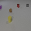
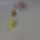

### PARTS model and segmentation training on Clevrer dataset in pytorch
(On-going) My implementation of [PARTS: Unsupervised segmentation with slots, attention and independence maximization](https://openaccess.thecvf.com/content/ICCV2021/papers/Zoran_PARTS_Unsupervised_Segmentation_With_Slots_Attention_and_Independence_Maximization_ICCV_2021_paper.pdf).
  
Implementation is finished but there could be bugs in the model. \
For example, I haven't successfully got disentangled representations (slots all decode to similar images).

ground truth \
 

reconstruction \

